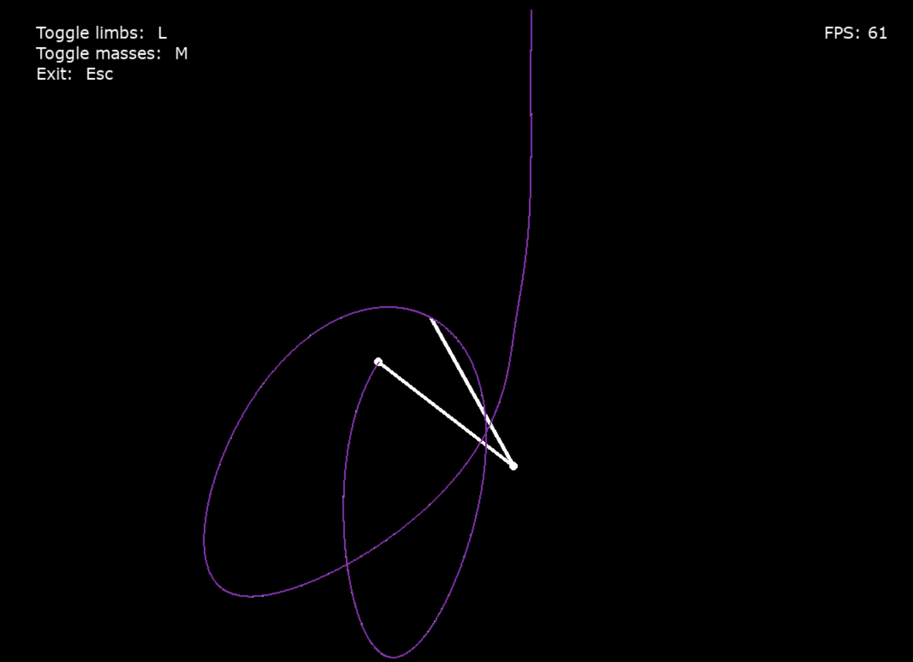

# Double Pendulum

This project aims to create a funny and beaultiful simulation of multiple double pendulums starting at close initial positions.


## How to run

### Create a venv and activate

```shell
python3 -m venv .venv
source .venv/bin/activate
```

### Install requirements
```shell
python3 -m pip install -r requirements.txt
```

### run it!
```shell
python3 main.py
```
